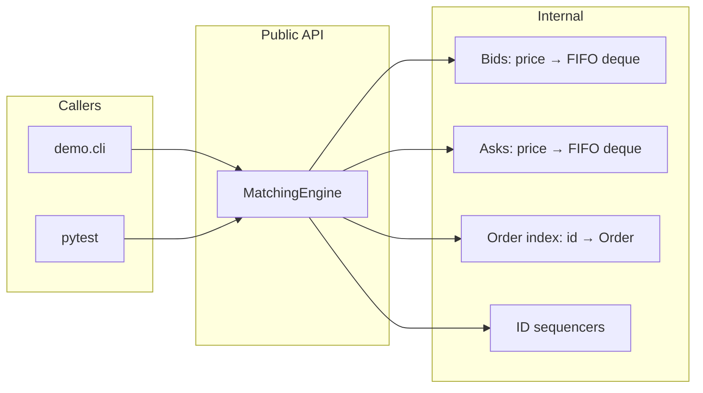
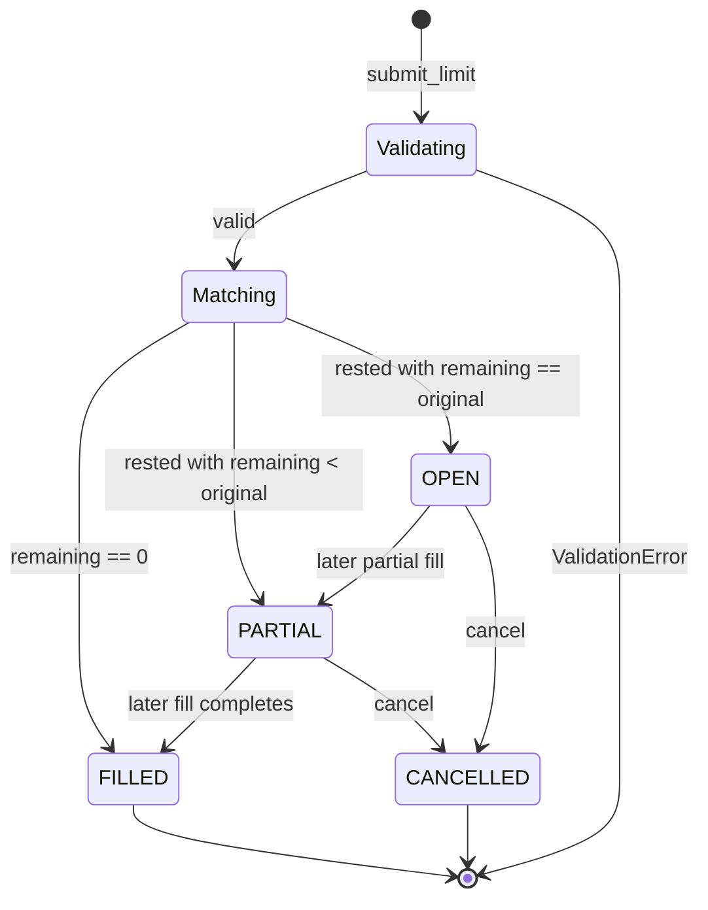

# Architecture

**Product:** Mini Matching Engine  
**Version:** 1.0

---

## 1. Components



| Component | Responsibility |
|-----------|----------------|
| `MatchingEngine` | Orchestrate validate → match → rest → cancel; own sequencers |
| Bids / Asks | Price levels; FIFO queues per price |
| Order index | Lookup by `order_id` for get/cancel |
| Types | Immutable-ish snapshots (`Trade`, `OrderBookSnapshot`); mutable `Order` remaining qty/status |

---

## 2. Order lifecycle



**Statuses**

| Status | Meaning |
|--------|---------|
| `OPEN` | Fully resting; no fills yet |
| `PARTIAL` | Some qty filled; remainder on book |
| `FILLED` | Remaining qty == 0; not on book |
| `CANCELLED` | Cancelled; not on book |

---

## 3. Matching loop (submit_limit)

Pseudo-code (normative behavior):

```
submit_limit(side, price, qty):
  validate(side, price, qty)
  order = new Order(id=next_order_id(), side, price, qty, remaining=qty, status=OPEN)
  index[order.id] = order
  trades = []

  while order.remaining > 0 and opposite_side_can_match(order):
      resting = peek_best_opposite(order.side)
      # BUY matches best (lowest) ask if ask.price <= order.price
      # SELL matches best (highest) bid if bid.price >= order.price
      if not price_crosses(order, resting):
          break
      fill_qty = min(order.remaining, resting.remaining)
      trade_price = resting.price          # MAKER / RESTING PRICE
      trade = new Trade(..., price=trade_price, quantity=fill_qty)
      trades.append(trade)
      order.remaining -= fill_qty
      resting.remaining -= fill_qty
      update_status(order); update_status(resting)
      if resting.remaining == 0:
          dequeue_and_remove_from_level(resting)

  if order.remaining > 0:
      enqueue_on_own_side(order)           # status OPEN or PARTIAL
  else:
      order.status = FILLED                # never rests

  return SubmitResult(order=order, trades=trades)
```

### Price crossing rules

| Aggressor | Matches when |
|-----------|----------------|
| BUY @ P | Best ask price ≤ P |
| SELL @ P | Best bid price ≥ P |

Always consume the **best** opposite price first; within that price, FIFO head first.

---

## 4. Cancel path

```
cancel(order_id):
  order = index.get(order_id) or raise OrderNotFoundError
  if order.status in (FILLED, CANCELLED):
      raise OrderNotCancellableError
  remove order from its price-level deque (or mark cancelled + exclude from matching/aggregates)
  order.remaining may stay as-is for audit; status = CANCELLED
  order must not appear in get_book() aggregates
  return order
```

---

## 5. Price-time priority (rules + examples)

### Rules

1. **Price priority:** Higher bids and lower asks are better.  
2. **Time priority:** At the same price, earlier resting order (FIFO) matches first.  
3. **Trade price:** Always the **resting (maker) order’s price**, not the aggressor’s limit.  
4. **Partial fills:** Reduce both sides’ remaining qty; dequeue resting only when remaining hits 0.

### Example A — time priority at same price

Book before aggressor:

| Side | Order | Price | Qty |
|------|-------|-------|-----|
| SELL | 1 | 100 | 10 |
| SELL | 2 | 100 | 5 |

Aggressor: BUY id=3, price=100, qty=12

| Trade id | Buy | Sell | Qty | Price |
|----------|-----|------|-----|-------|
| 1 | 3 | 1 | 10 | 100 |
| 2 | 3 | 2 | 2 | 100 |

After: Order 1 FILLED; Order 2 PARTIAL remaining 3 @ 100; Order 3 FILLED.  
Book asks: `100 → 3` (order 2 only).

### Example B — price priority across levels

Book:

| Side | Order | Price | Qty |
|------|-------|-------|-----|
| SELL | 10 | 99 | 4 |
| SELL | 11 | 100 | 4 |

Aggressor: BUY id=12, price=100, qty=6

Trades:

| Trade | Sell | Qty | Price | Why |
|-------|------|-----|-------|-----|
| T1 | 10 | 4 | **99** | Best ask first; maker price 99 |
| T2 | 11 | 2 | **100** | Next level; maker price 100 |

Order 12 FILLED. Order 11 remaining 2 @ 100.

### Example C — no cross → pure rest

Empty book. BUY id=1 @ 50 qty 10 → rests. No trades.  
`get_book().bids == [BookLevel(price=50, quantity=10, order_count=1)]`.

---

## 6. Trade generation rules (locked)

| Question | Decision |
|----------|----------|
| Trade price? | **Resting / maker price** |
| Trade quantity? | `min(aggressor.remaining, resting.remaining)` |
| Trade order? | Chronological as matching proceeds (best price, then FIFO) |
| Aggressor never on book until matching exhausted | Yes |
| Self-trade same order_id | Impossible: unique ids; no modification that reuses id |

---

## 7. Full worked example (canonical)

**Symbol:** `"DEMO"`  
**Sequence:**

| Step | Action | Result |
|------|--------|--------|
| 1 | `submit_limit(SELL, 100, 10)` | Order id=1 OPEN rests. Trades=[] |
| 2 | `submit_limit(SELL, 100, 5)` | Order id=2 OPEN rests behind 1. Trades=[] |
| 3 | `submit_limit(BUY, 101, 3)` | Crosses. Trade id=1: buy=3,sell=1,qty=3,price=**100**. Order 3 FILLED. Order 1 remaining 7. |
| 4 | `submit_limit(BUY, 100, 10)` | Trade id=2: buy=4,sell=1,qty=7,px=100. Trade id=3: buy=4,sell=2,qty=3,px=100. Order 4 FILLED. Order 1 FILLED. Order 2 remaining 2. |
| 5 | `cancel(2)` | Order 2 CANCELLED. Book empty. |

**After step 4 (before cancel):**

```
Bids: (empty)
Asks: 100 × 2  (order 2)
```

**Trades in order:**

```
Trade(trade_id=1, symbol="DEMO", buy_order_id=3, sell_order_id=1, price=100, quantity=3)
Trade(trade_id=2, symbol="DEMO", buy_order_id=4, sell_order_id=1, price=100, quantity=7)
Trade(trade_id=3, symbol="DEMO", buy_order_id=4, sell_order_id=2, price=100, quantity=3)
```

This sequence MUST be covered by pytest `test_worked_example_canonical` (see TEST_PLAN).

---

## 8. Complexity notes (recommended dict+deque)

| Op | Cost |
|----|------|
| Rest at known price | O(1) append |
| Match k fills | O(k) pops/updates; best price via min/max key scan O(P) or better with sorted structure |
| Cancel | O(1) lookup; O(L) deque remove unless lazy tombstone |
| Snapshot | O(levels + orders) to aggregate |

Optimizations optional; correctness first.

---

## 9. Explicit non-architecture

- No persistence, replication, or WAL  
- No network protocol  
- No multi-symbol routing  
- No fee or maker/taker rebate calculation beyond price rule above
